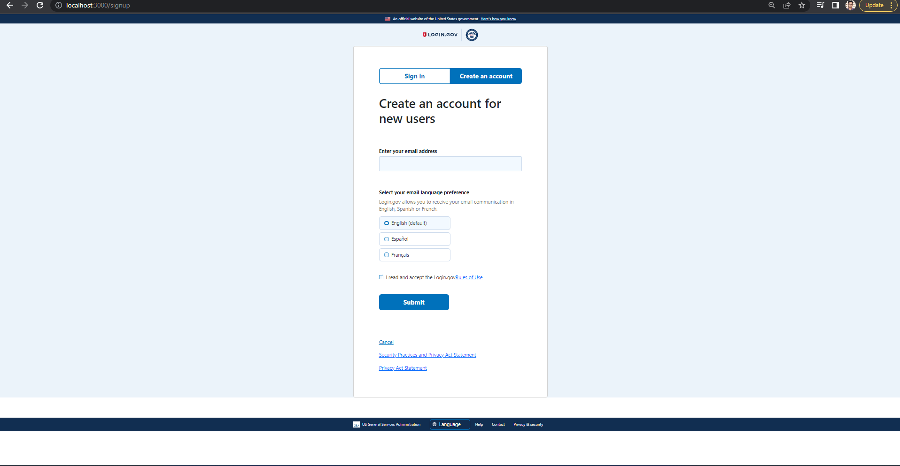
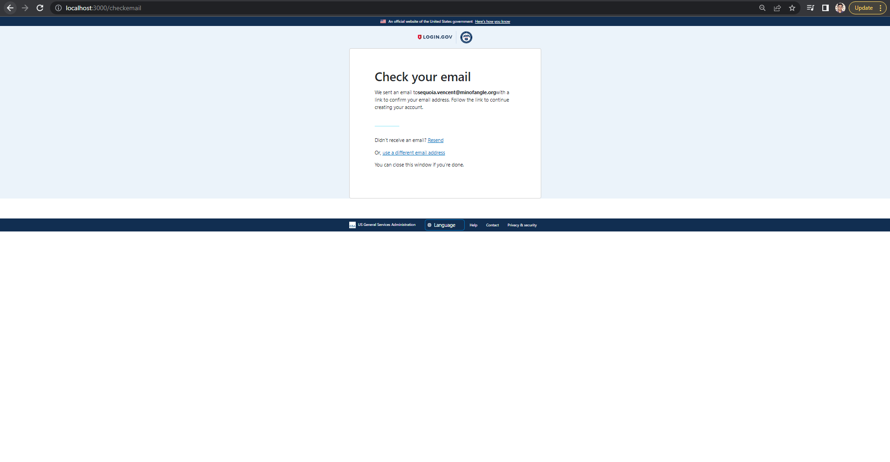
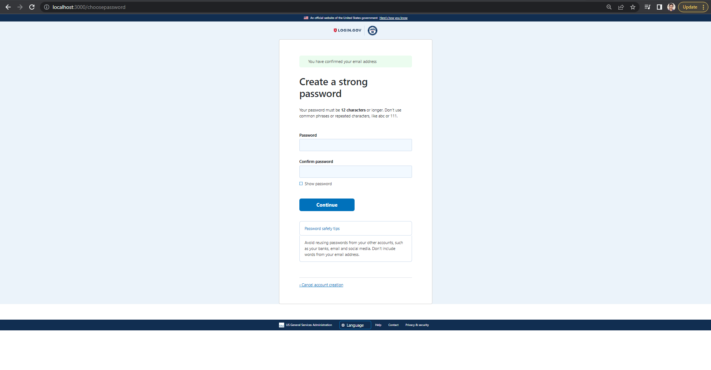
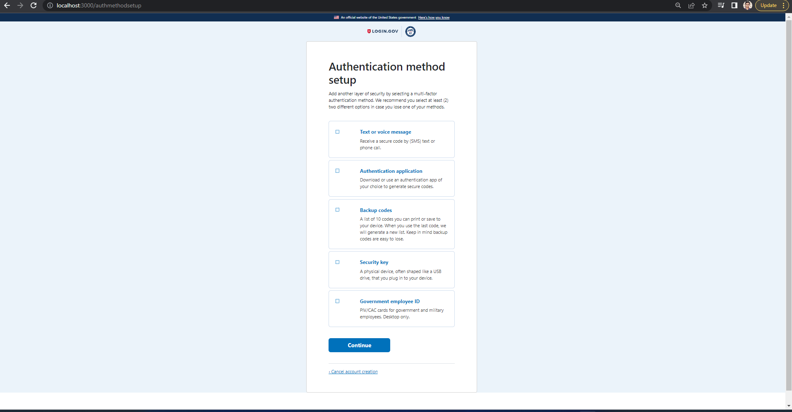
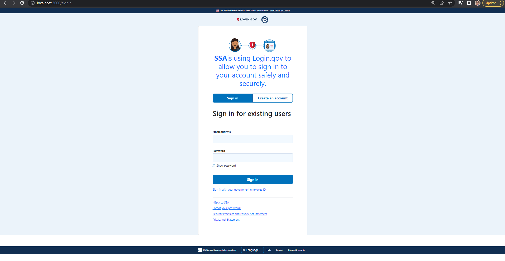
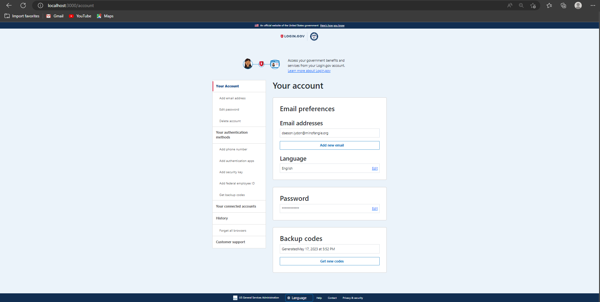
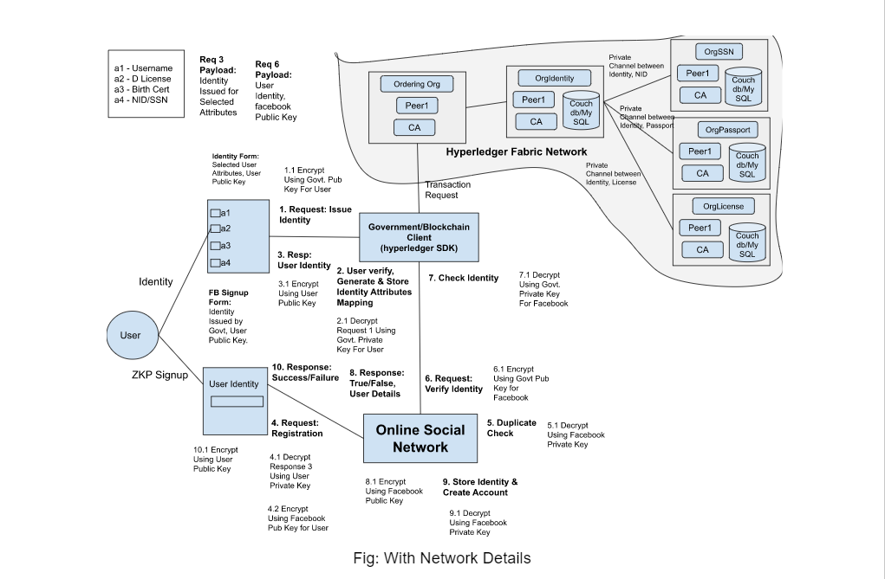

### Zero Knowledge Proof Signup: Government Module
### Used Technologies:

Component         | Technology
---               | ---
Backend           | Spring: Boot, Data
Frontend          | React.js, Redux, Bootstrap
Database          | MySQL
Persistence       | JPA 
Client Build      | npm, yarn, webpack
Server Build      | Maven

## Getting Started

### Backend
- Go to your project folder and run SpringBootApplication.
- The server will start on port 8080.

### Frontend
- Go to your project folder from your terminal `cd react-frontend`
- Run: `npm install` or `yarn install`
- After install, run: `npm run start` or `yarn start`
- Open your browser (http://localhost:3000)

## Screenshots

[//]: # ()
[//]: # (### Employee List)

[//]: # (![list]&#40;img/Employees_List.jpg&#41;)

[//]: # ()
[//]: # (### Add Employee)

[//]: # (![add]&#40;img/Employees_Add.jpg&#41;)

[//]: # ()
[//]: # (### Edit Employee)

[//]: # (![edit]&#40;img/Employees_Edit.jpg&#41;)

### Steps to create account
-> Create Account (signup component)

-> input fields: email

-> Check Email (CheckEmail component)

-> Choose Password (after clicking link sent in email) (ChoosePassword component)

-> input fields: password, confirm password

-> Authentication Method Setup (AuthenticationMethodSetupComponent component)

### Steps to sing in
-> Sign in (signin component)

-> input fields: email, password

-> Dashboard (AccountLogin component)

### Architecture Diagram

