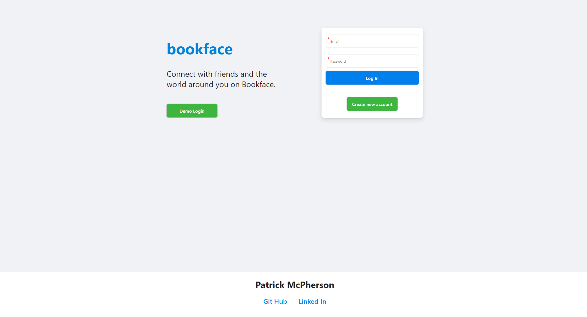
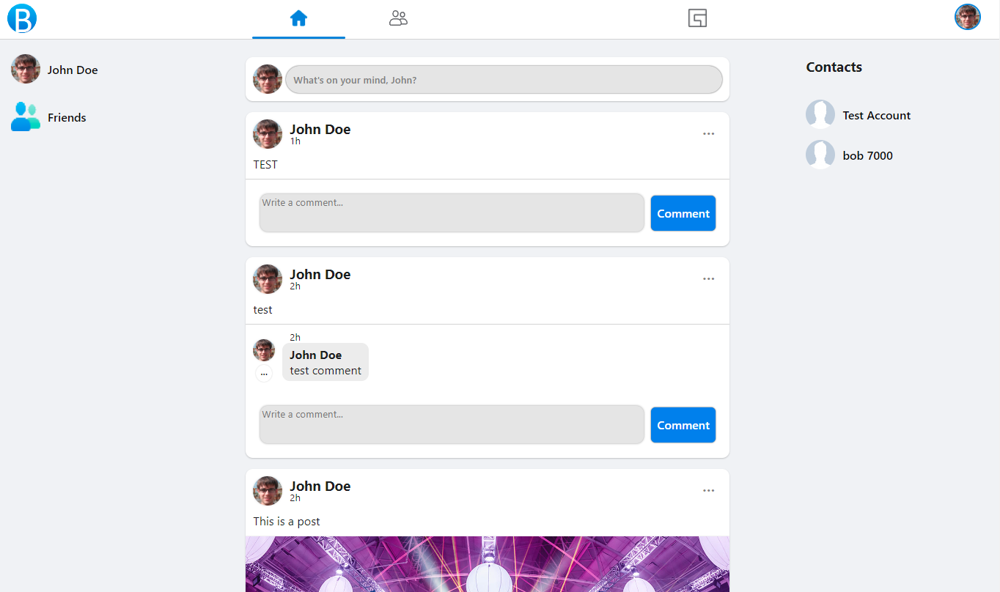
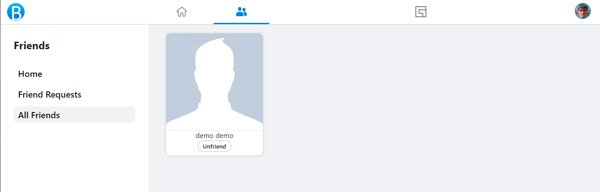
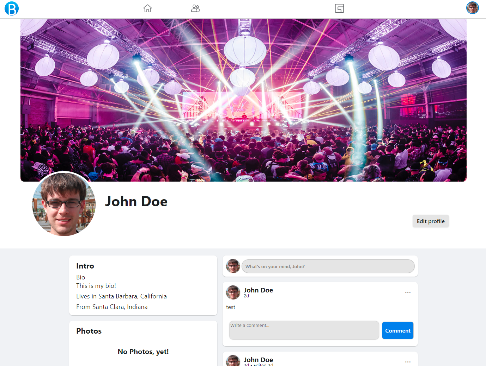

# Bookface

---

Bookface is a Facebook clone and was built using PostgreSQL, Flask, SQLAlchemy, React, Redux, javascript and Python.

Checkout Bookface at https://bookface-frwd.onrender.com/

### Github Wiki Links:

#### [Features List](https://github.com/Patricus/BookFace/wiki/Feature-List)

#### [Database Schema](https://github.com/Patricus/BookFace/wiki/Database-Schema)

#### [User Stories](https://github.com/Patricus/BookFace/wiki/User-Stories)

#### [Wire Frames and Front End Routes](https://github.com/Patricus/BookFace/wiki/Wireframes-and-Front-End-Routes)

## Login Page



## Post Feed Page



## Friends Page



## Profile Page



## Run Bookface on a local machine:

-   This project requires AWS Buckets, if you don't know how to set buckets up follow this walkthrough's "Create your AWS User and Bucket" section:

    > https://github.com/jamesurobertson/aws-s3-pern-demo#create-your-aws-user-and-bucket

-   then follow these instructions to change bucket permissions:

    > https://github.com/jamesurobertson/aws-s3-pern-demo#public-file-read-configuration

-   Clone https://github.com/Patricus/BookFace
-   Set up your database:
    -   Create a database user with the name and password of your choice
    -   Create a database with the name of your choice and make sure that the owner of the database is the database user that you created in the pervious step
-   In your root directory run pipenv install
-   Add a .env file in your root directory and make sure to add the following items listed below

    ```
    FLASK_APP=app
    FLASK_ENV=development
    SECRET_KEY=<<secret key>>
    DATABASE_URL=postgresql://<<database user>>:<<password>>@localhost/<<database>>
    S3_BUCKET=<<your s3 bucket name>>
    S3_KEY=<<your s3 key>>
    S3_SECRET=<<your s3 secret>>

    ```

-   cd into the react-app directory and run npm install
-   Create a .env file in the root of the react-app directory and add the following code:
    ```
    REACT_APP_BASE_URL=http://localhost:5000
    ```
-   In order to get the backend running, make sure you are in the root directory and run the "pipenv shell" command to enter your python shell. Please run "flask db migrate" followed by "flask db upgrade", followed by "flask seed all". Finally we can run the command "flask run" and your backend should start right up, connected to an already seeded database.
-   Lastly, open an additional terminal to run you your frontend. cd into react-app and use the command "npm start". This should automatically open up your app on localhost:3000

## Technical Details:

-   Friend's states are determined by a friend table that contains:
    -   `user_id` The user that requested the friendship's id
    -   `friend_id` The user that is being requested's id
    -   `accepted` A boolean indicating if the friend request has been accepted

```
@friend_routes.route('/')
@login_required
def read_friends():
    """
    Read all friends.
    """
    friends = User.query.join(Friend, or_(Friend.friend_id == User.id, Friend.user_id == User.id)).filter(
        and_(Friend.accepted == True, User.id != current_user.id)).all()

    return {'friends': [friend.to_dict() for friend in friends]}


@friend_routes.route('/requests/')
@login_required
def read_friend_requests():
    """
    Read all friend requests.
    """
    friend_requests = User.query.join(Friend, Friend.user_id == User.id).filter(
        and_(Friend.accepted == False, User.id != current_user.id, Friend.friend_id == current_user.id)).all()

    return {'friend_requests': [friend_request.to_dict() for friend_request in friend_requests]}


@friend_routes.route('/requests/sent/')
@login_required
def read_sent_requests():
    """
    Read all sent requests.
    """
    friend_requests = User.query.join(Friend, Friend.friend_id == User.id).filter(
        and_(Friend.accepted == False, User.id != current_user.id, Friend.user_id == current_user.id)).all()

    return {'friend_requests': [friend_request.to_dict() for friend_request in friend_requests]}
```

-   Backend errors are parsed and sorted to the correct input error variable to be displayed next to said input field.

```
useEffect(() => {
    const emailErrs = [];
    const passwordErrs = [];
    errors.forEach(error => {
        error = error.split(":");
        if (error[0] === "email") emailErrs.push(error[1]);
        if (error[0] === "password") passwordErrs.push(error[1]);
    });
    setEmailErrors(emailErrs);
    setPasswordErrors(passwordErrs);
}, [errors]);
```

```
{emailErrors.length > 0 && (
    <div className="errors">
        <div className="error">{emailErrors}</div>
    </div>
)}
<div className="required"></div>
<input
    name="email"
    type="email"
    placeholder="Email"
    value={email}
    onChange={e => {
        setEmail(e.target.value);
    }}
/>
{passwordErrors.length > 0 && (
    <div className="errors">
        <div className="error">{passwordErrors}</div>
    </div>
)}
<div className="required"></div>
<input
    name="password"
    type="password"
    placeholder="Password"
    value={password}
    onChange={e => {
        setPassword(e.target.value);
    }}
/>
```

## To-Do:

### Likes / Unlike a post

Logged in users can like posts, see how many likes a post has, and unlike a post they have already liked.

### Search Bar

Logged in users can use the search bar to find other users.

### Groups

Logged in users can create and join groups, these groups will have:

-   A group owner.
-   Their own group post feed.
-   Control which users may join.

### Chat

Logged in users can chat with their friends.
